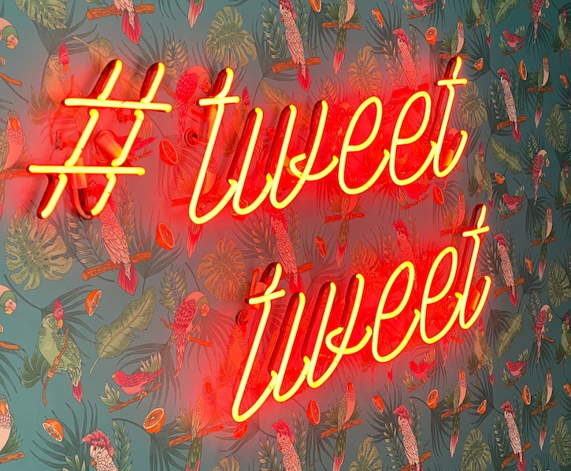
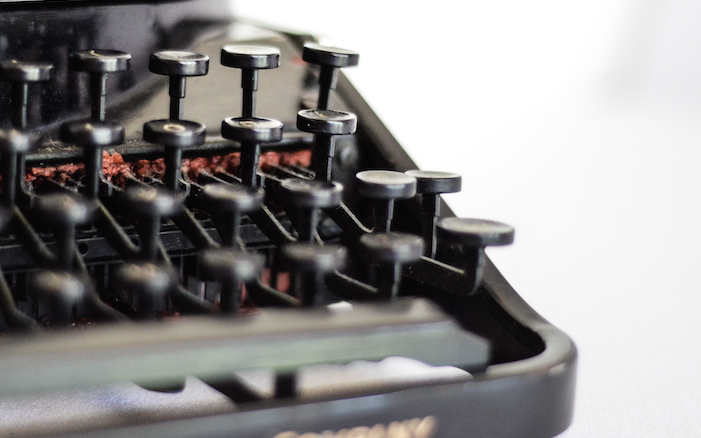

# A.I._president
M.L. generated tweets based on web scraping twitter and Markov generated text using splinter, beautiful soup and NLTK.

## Webpage
Results of the project are hosted in GitHub pages: <a href='https://sherirosalia.github.io/A.I._president/'>A.I. President</a>

## Folder structure
- docs holds html, css, image, javascript and json files for display site
- python folder contains scraping, file conversion and markov chain scripts
- initial data from webscraping is in data folder

## Frameworks, Languages
- Python
- Beautiful Soup
- Selenium
- Splinter
- Markovify
- Pandas
- Javascript
- Html
- CSS

## Deployment
The core files are in the python folder which contains both Jupyter notebooks and stand alone scripts. Note that Twitter changes the site regularly so selectors will likely need to be updated for the webscrping code to work. File paths will also need to be adjusted.

## Credit for "tweet tweet" photo
Photo by <a href="https://unsplash.com/@chrisjdavis?utm_source=unsplash&amp;utm_medium=referral&amp;utm_content=creditCopyText">Chris J. Davis</a> on <a href="https://unsplash.com/s/photos/tweet?utm_source=unsplash&amp;utm_medium=referral&amp;utm_content=creditCopyText">Unsplash</a>

## Credit for typewriter photo
Photo by <a href="https://unsplash.com/@hudsoncrafted?utm_source=unsplash&amp;utm_medium=referral&amp;utm_content=creditCopyText">Debby Hudson</a> on <a href="https://unsplash.com/s/photos/typewriter?utm_source=unsplash&amp;utm_medium=referral&amp;utm_content=creditCopyText">Unsplash</a>

